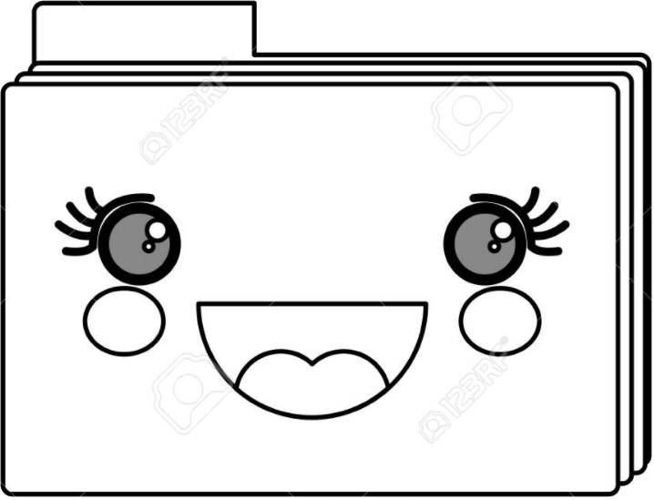

## TEMA 1 | Terminal

#### Estudos baseados em: 

"Aprenda Python 3 do Jeito Certo"

Zed A. Shaw 

(págs. 255-291)



#### Comandos abordados:

Foram realizados exercícios práticos com os seguintes comandos:
```
pwd | imprimir diretório de trabalho

mkdir | criar diretório
mkdir - dir0/dir1/dir2/dirn | criar a árvore completa de diretórios

cd | mudar diretório

ls | listar diretório atual
ls <nome_do_dir> | lista os diretórios e arquivos do <nome_do_dir>
ls -a <nome_do_dir> | imprime os nomes de todos os arquivos 
ls -al <nome_do_dir> | imprime em formato de lista os nomes de todos os arquivos
ls -r <nome_do_dir> | imprime a árvore completa de diretórios

rmdir <nome_do_dir> | remover diretório
rm -rf <nome_do_dir> | remover diretório em modo forçado (com todo o conteúdo)

pushd | salvar diretório atual
popd | restaurar diretório para o último trabalhado

cp | copiar um arquivo ou diretório

mv | mover um arquivo ou diretório e renomear (para não renomear, basta informar o mesmo nome)
mv <nome_do_dir>/<nome_do_arquivo> ./ | mover um arquivo sem renomeá-lo

less | paginar um arquivo

cat | ver o conteúdo de um arquivo direto no terminal

open | abrir um arquivo

clear | limpar o terminal 

touch | cria um arquivo no diretório atual 
touch <nome_do_dir>/<nome_do_arquivo> | cria um arquivo no diretório da árvore

echo "texto_informado" > <nome_do_dir>/<nome_do_arquivo> | salva o conteúdo no arquivo informado
```
Mais informações em [clique aqui](https://www.oreilly.com/playlists/6b0ba469-d706-45a0-ae95-05560a7ef529/)

#### Exercícios resolvidos:
* em breve~ 